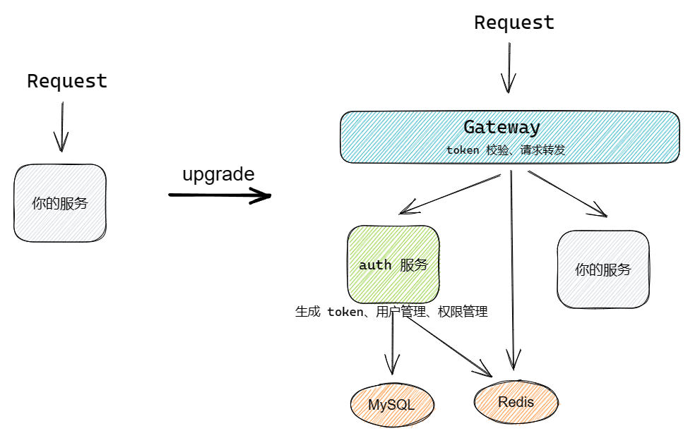

# auth-everything

<font color=red>文档待完善...</font>

为一切后端加入认证授权机制，而后端不需要做任何改动！

## 项目描述

当完成一个后端项目后，为了使其上线，我们往往需要加入认证授权机制来保护后端的访问，但这个认证授权机制需要我们花费很多时间去完成，甚至很多后端系统难以改动。

本项目通过引入一个 API 网关和单点登录服务，使得由单点登录服务执行认证授权，由 API 网关完成权限校验，并将我们的后端系统作为一个服务被 API 网关保护起来，从而实现 auth everything。

项目架构如下图：

<center></center>

因此，借助于本项目，当你想为一个后端系统加入认证授权机制的话，你所需要的做就是：

1. 将其打包为 Docker
2. 在 docker-compose.yml 中添加一个 service
3. 在 Gateway 中加入一条转发规则

All finished!

## 技术栈

- docker-compose：实现容器服务编排（后续计划支持 Kubernetes）
- Spring Cloud Gateway：网关技术选型，统一访问流量并进行认证鉴权
- Spring Boot 3.1：后端启动环境
- [Sa Token](https://sa-token.dev33.cn/)：提供身份验证、单点登录、权限校验等功能
- [Nacos](https://nacos.io/)：用于实现网关配置项的动态配置
- MySQL 8
- Vue 3：实现可视化操作界面

## 项目启动

**step 1 克隆本项目**：

```sh
git clone git@github.com:yubinCloud/auth-everything.git
```

**step 2 docker-compose 启动**：在项目根目录下执行如下命令：

```sh
docker-compose build
docker-compose up
```

由于首次启动需要初始化 MySQL 数据，因此可能较慢。

## 如何使用本项目

本项目提供了一个使用 FastAPI 实现的 Python 后端服务 `hello-service`，并将其编排进 docker-compose 与 Gateway 中，你所需要做的就是将其替换为你的后端服务，由此你的后端服务便具备了身份验证与权限校验的功能。

### step 1 将你的后端服务添加进来

将目录 `./hello-service` 替换为你的项目，并编写 Dockfile。

在 docker-compose.yml 中添加一个你的服务，可参考 hello-service 作为示例来添加，指定一个容器名、服务名及暴露端口号。

### step 2 在网关中添加转发规则配置

在 `./gateway/src/main/resources/application.yaml` 加入一个对你的服务的请求转发。

在 `./gateway/src/main/java/com/example/gateway/stp/StpInterfaceImpl.java` 这个拦截器中加入一个对你的服务的身份验证要求。

### step 3 重新启动

```sh
docker-compose build
docker-compose up
```
